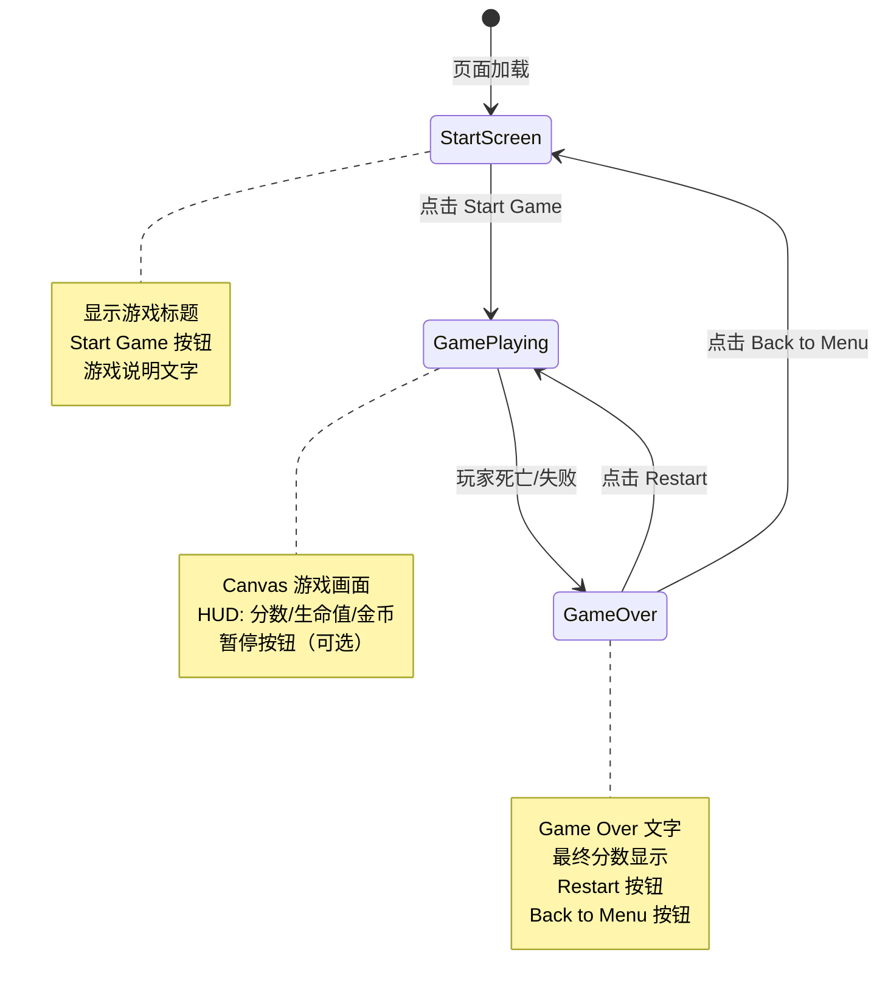

# UX 设计 — [BUG] index.html 文件被截断导致游戏无法启动

> 所属需求：[BUG修复] Start Game 按钮点击无响应

## 交互流程图


```

## 组件线框说明

## 页面结构

### 1. Start Screen（开始界面）
```
┌─────────────────────────────────┐
│                                 │
│        [Game Title]             │
│                                 │
│     ┌─────────────────┐         │
│     │  Start Game     │         │
│     └─────────────────┘         │
│                                 │
│   使用方向键移动，空格跳跃        │
│   收集金币，避开敌人              │
│                                 │
└─────────────────────────────────┘
```

### 2. Game Playing（游戏进行中）
```
┌─────────────────────────────────┐
│ Score: 0  Lives: ❤❤❤  Coins: 0 │ ← HUD 层
├─────────────────────────────────┤
│                                 │
│                                 │
│         [Canvas 游戏区域]        │ ← 游戏渲染层
│                                 │
│                                 │
└─────────────────────────────────┘
```

### 3. Game Over Screen（游戏结束界面）
```
┌─────────────────────────────────┐
│                                 │
│         GAME OVER               │
│                                 │
│      Final Score: 1250          │
│      Coins Collected: 15        │
│                                 │
│     ┌─────────────────┐         │
│     │    Restart      │         │
│     └─────────────────┘         │
│     ┌─────────────────┐         │
│     │ Back to Menu    │         │
│     └─────────────────┘         │
│                                 │
└─────────────────────────────────┘
```

## 组件层级
- **UI 容器层**：开始界面、游戏结束界面（position: absolute，覆盖在 Canvas 上）
- **Canvas 层**：游戏渲染画布（固定尺寸 800x600）
- **HUD 层**：游戏中的分数/生命值显示（position: absolute，固定在顶部）

## 交互状态定义

## 按钮状态

### Start Game 按钮
- [x] **默认（normal）**：可点击状态，清晰可见
- [x] **悬停（hover）**：鼠标悬停时轻微放大（scale: 1.05）+ 亮度提升
- [x] **按下（active）**：点击瞬间缩小（scale: 0.95）+ 亮度降低
- [x] **禁用（disabled）**：游戏加载中时 opacity: 0.5，cursor: not-allowed
- [x] **加载中（loading）**：初始化游戏资源时显示 "Loading..." 文字，禁止点击

### Restart 按钮
- [x] **默认（normal）**：游戏结束后可点击
- [x] **悬停（hover）**：scale: 1.05
- [x] **按下（active）**：scale: 0.95
- [ ] **禁用**：不适用（游戏结束后始终可用）

### Back to Menu 按钮
- [x] **默认（normal）**：次要按钮样式（与 Restart 区分）
- [x] **悬停（hover）**：scale: 1.03（比主按钮动效更轻微）
- [x] **按下（active）**：scale: 0.97

## Canvas 游戏区域状态
- [x] **初始化中**：显示黑色背景 + 中央 Loading 文字
- [x] **游戏进行中**：60fps 渲染游戏实体（玩家、平台、敌人、金币）
- [x] **暂停状态**（可选功能）：游戏画面静止 + 半透明遮罩 + "PAUSED" 文字
- [x] **游戏结束**：Canvas 停止更新，显示最后一帧画面（可选：添加灰度滤镜）

## HUD 元素状态
- [x] **分数（Score）**：实时更新，击败敌人/收集金币时数字跳动动画
- [x] **生命值（Lives）**：
  - 满血：3 个红心图标
  - 受伤：对应心图标变灰 + 闪烁动画
  - 死亡：所有心图标变灰
- [x] **金币计数（Coins）**：收集时 +1 动画（数字放大后恢复）

## 页面级状态
- [x] **首次加载**：显示 Start Screen，Canvas 预初始化但不渲染
- [x] **游戏运行中**：隐藏所有 UI 面板，只显示 HUD + Canvas
- [x] **游戏结束**：显示 Game Over 面板（从下向上滑入 + fade in，200ms）
- [x] **重新开始**：Game Over 面板淡出（150ms）→ 重置游戏状态 → 开始新游戏
- [x] **返回菜单**：Game Over 面板淡出 → 显示 Start Screen

## 响应式/适配规则

## 断点定义
- **Mobile**: < 768px（竖屏手机）
- **Tablet**: 768px - 1024px（平板/小屏笔记本）
- **Desktop**: > 1024px（桌面显示器）

## Canvas 尺寸适配

### Desktop (> 1024px)
- Canvas 固定尺寸：800x600px
- 居中显示：`margin: 0 auto`
- UI 面板宽度：600px（居中）

### Tablet (768px - 1024px)
- Canvas 缩放至容器宽度的 90%（保持 4:3 宽高比）
- 最大宽度：700px
- UI 面板宽度：80%（最大 500px）

### Mobile (< 768px)
- Canvas 缩放至屏幕宽度的 95%（保持 4:3 宽高比）
- 最小宽度：320px
- UI 面板宽度：90%
- 按钮高度增加至 48px（符合触摸目标尺寸）
- HUD 字体缩小至 14px（桌面端 16px）

## 布局调整

### Start Screen
- **Desktop**: 标题字号 48px，按钮宽度 200px
- **Tablet**: 标题字号 36px，按钮宽度 180px
- **Mobile**: 标题字号 28px，按钮宽度 160px，说明文字缩小至 14px

### Game Over Screen
- **Desktop**: 两个按钮横向排列（flex-direction: row）
- **Mobile**: 两个按钮纵向堆叠（flex-direction: column），间距 12px

## 触摸优化（Mobile）
- 所有按钮最小触摸区域：44x44px（iOS 标准）
- 移除 hover 效果（触摸设备无意义）
- 添加 `touch-action: manipulation` 防止双击缩放
- 按钮按下时显示明显的 active 状态（scale + 背景色变化）

## 性能优化
- Canvas 在移动端降低渲染分辨率（使用 `devicePixelRatio` 的 0.75 倍）
- 粒子效果数量在移动端减半
- 使用 CSS `will-change: transform` 优化动画性能

## UI 资产清单（初稿）

## 图标（Icons）

### 游戏内图标
- **heart-full**: 生命值满血图标，16x16px，实心红色心形，pixel art 风格
- **heart-empty**: 生命值损失图标，16x16px，灰色空心心形，pixel art 风格
- **coin**: 金币图标，24x24px，金黄色圆形硬币，pixel art 风格（用于 HUD 显示）
- **pause**: 暂停按钮图标（可选功能），24x24px，两条竖线，outline 风格
- **play**: 继续游戏图标（可选功能），24x24px，三角形，outline 风格

### UI 装饰图标
- **trophy**: 游戏结束界面装饰，48x48px，金色奖杯，用于高分显示
- **star**: 分数增加时的粒子效果，12x12px，五角星，黄色发光

## 插画（Illustrations）

### 空状态/错误状态
- **loading-game**: 游戏加载界面，400x300px，简单的像素风格动画（旋转的齿轮或跳动的方块）
- **game-over-banner**: 游戏结束顶部装饰，600x150px，像素风格的 "GAME OVER" 艺术字

## 游戏实体精灵（Sprites）

### 玩家角色
- **player-idle**: 玩家静止状态，32x32px，pixel art，蓝色方块角色
- **player-jump**: 玩家跳跃状态，32x32px，pixel art，角色向上伸展姿态
- **player-run**: 玩家奔跑动画（2-4 帧），32x32px，pixel art，循环播放

### 敌人
- **enemy-basic**: 基础敌人，32x32px，pixel art，红色尖刺球或怪物
- **enemy-patrol**: 巡逻敌人动画（2 帧），32x32px，pixel art，左右移动

### 环境元素
- **platform**: 平台贴图，可平铺，32x16px，pixel art，草地/石头纹理
- **coin-sprite**: 金币精灵动画（4 帧），24x24px，pixel art，旋转效果
- **background**: 背景图层，800x600px，pixel art，天空+云朵+远山（视差滚动）

## 图片（Images）

### 背景
- **start-screen-bg**: 开始界面背景，800x600px，深色渐变或星空主题
- **game-over-bg**: 游戏结束界面背景（可选），800x600px，半透明深色遮罩

## 字体（Fonts）
- **游戏标题字体**: 像素风格字体（如 Press Start 2P），用于 "GAME OVER" 和游戏标题
- **UI 文字字体**: 清晰易读的无衬线字体（如 Arial/Roboto），用于分数、说明文字

## 音效（可选，不在视觉范围但列出供参考）
- jump.wav: 跳跃音效
- coin.wav: 收集金币音效
- hit.wav: 受伤音效
- game-over.wav: 游戏结束音效
- bgm.mp3: 背景音乐循环
