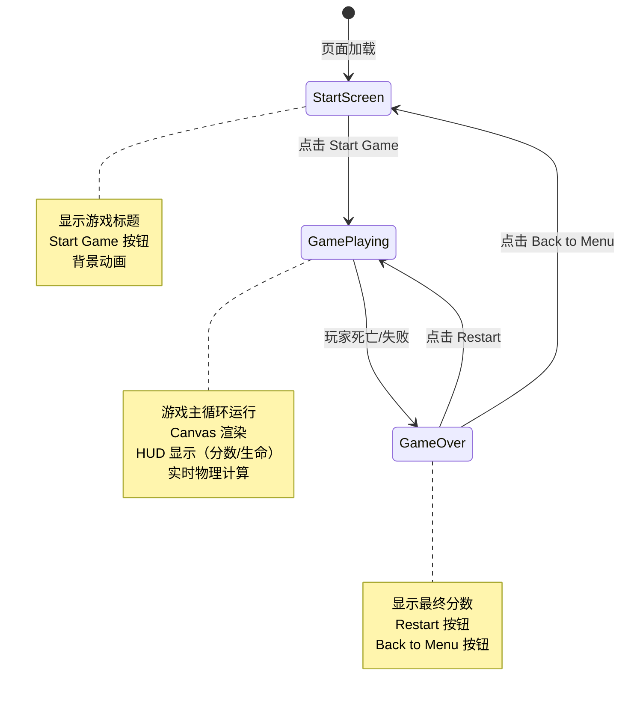

# UX 设计 — [BUG] index.html 文件被截断导致游戏无法启动

> 所属需求：[BUG修复] Start Game 按钮点击无响应

## 交互流程图


```

## 组件线框说明

## 页面结构

### StartScreen（开始界面）
```
+----------------------------------+
|        [游戏标题区域]              |
|     (居中，大号文字)               |
|                                  |
|                                  |
|      [Start Game 按钮]           |
|        (居中，主按钮)              |
|                                  |
|                                  |
|    [背景装饰元素/动画]             |
+----------------------------------+
```

### GamePlaying（游戏进行中）
```
+----------------------------------+
| [HUD 顶部栏]                      |
| Score: 0    Lives: ❤❤❤          |
+----------------------------------+
|                                  |
|                                  |
|        [Canvas 游戏区域]          |
|      (玩家/平台/敌人/金币)         |
|                                  |
|                                  |
+----------------------------------+
```

### GameOver（游戏结束）
```
+----------------------------------+
|                                  |
|        Game Over!                |
|                                  |
|      Final Score: 1234           |
|                                  |
|      [Restart 按钮]              |
|                                  |
|    [Back to Menu 按钮]           |
|                                  |
+----------------------------------+
```

## 核心组件

1. **GameCanvas**：主游戏渲染区域（<canvas> 元素）
2. **StartButton**：开始游戏按钮
3. **RestartButton**：重新开始按钮
4. **MenuButton**：返回菜单按钮
5. **HUD**：抬头显示（分数、生命值）
6. **GameOverPanel**：游戏结束面板

## 交互状态定义

## 按钮状态

### Start Game 按钮
- [x] **默认（normal）**：可点击状态，清晰可见
- [x] **悬停（hover）**：鼠标悬停时轻微放大（scale 1.05）+ 亮度提升
- [x] **按下（active）**：点击瞬间缩小（scale 0.95）
- [x] **禁用（disabled）**：游戏加载中时 opacity 0.5，不可点击
- [x] **加载中（loading）**：初始化游戏资源时显示 spinner，防止重复点击

### Restart 按钮
- [x] **默认（normal）**：游戏结束后可点击
- [x] **悬停（hover）**：scale 1.05 + 亮度变化
- [x] **按下（active）**：scale 0.95
- [x] **禁用（disabled）**：重启过程中禁用（防止连点）

### Back to Menu 按钮
- [x] **默认（normal）**：次要按钮样式
- [x] **悬停（hover）**：边框高亮
- [x] **按下（active）**：scale 0.95

## 游戏状态

### Canvas 游戏区域
- [x] **初始化中**：显示 Loading 文字或进度条
- [x] **游戏进行中**：正常渲染，60fps 刷新
- [x] **暂停（可选）**：游戏画面静止，显示半透明遮罩 + Resume 按钮
- [x] **游戏结束**：停止渲染，显示最终画面（可选：定格最后一帧）

### HUD 元素
- [x] **分数显示**：实时更新，数字变化时短暂高亮（0.3s）
- [x] **生命值**：
  - 满血：3 个红心图标
  - 受伤：对应心图标变灰/消失，带抖动动画
  - 死亡：所有心图标消失

## 页面级状态

### 游戏加载
- [x] **首次加载**：显示 Loading 文字 + 进度百分比（加载 JS 模块）
- [x] **资源加载失败**：显示错误提示 + Retry 按钮

### 空状态（不适用于此游戏）

### 错误状态
- [x] **Canvas 不支持**：提示「浏览器不支持 Canvas，请升级浏览器」
- [x] **JS 模块加载失败**：提示「游戏资源加载失败」+ Reload 按钮
- [x] **游戏崩溃**：捕获异常后显示「游戏出错，请刷新页面」

## 响应式/适配规则

## 断点定义
- **Mobile**: < 768px（竖屏手机）
- **Tablet**: 768px - 1024px（平板/横屏手机）
- **Desktop**: > 1024px（桌面浏览器）

## 响应式策略

### Canvas 游戏区域
- **Mobile**: 
  - Canvas 宽度 100vw，高度 60vh（为 HUD 和按钮留空间）
  - 触摸控制：虚拟按键（左/右/跳跃）固定在底部
- **Tablet**: 
  - Canvas 宽度 90vw，高度 70vh
  - 支持触摸 + 键盘控制
- **Desktop**: 
  - Canvas 固定尺寸（如 800x600）居中显示
  - 仅键盘控制（方向键 + 空格）

### 按钮尺寸
- **Mobile**: 
  - 按钮最小高度 48px（符合触摸热区标准）
  - 宽度 80% 屏幕宽度，居中
- **Tablet**: 
  - 按钮高度 56px
  - 宽度 60% 或固定 400px（取较小值）
- **Desktop**: 
  - 按钮高度 48px
  - 宽度固定 300px
  - hover 效果启用

### HUD 布局
- **Mobile**: 
  - 分数和生命值分两行显示（避免拥挤）
  - 字号 16px
- **Tablet/Desktop**: 
  - 分数左对齐，生命值右对齐（同一行）
  - 字号 18px

### 游戏结束面板
- **Mobile**: 
  - 面板宽度 90vw
  - 按钮垂直堆叠（Restart 在上，Menu 在下）
- **Tablet/Desktop**: 
  - 面板固定宽度 500px 居中
  - 按钮水平排列（Restart 和 Menu 并排）

## 方向锁定
- **Mobile**: 建议锁定为横屏（landscape）以获得更好游戏体验
- 竖屏时显示提示：「请旋转设备以获得最佳体验」

## UI 资产清单（初稿）

## 图标（Icons）

- **icon: heart-full**（生命值满血图标，24x24px，填充风格，红色）
- **icon: heart-empty**（生命值空血图标，24x24px，描边风格，灰色）
- **icon: restart**（重启图标，32x32px，循环箭头，outline 风格）
- **icon: menu**（菜单图标，32x32px，三横线或返回箭头，outline 风格）
- **icon: loading-spinner**（加载动画，48x48px，旋转圆环）
- **icon: arrow-left**（虚拟按键-左，48x48px，填充风格）
- **icon: arrow-right**（虚拟按键-右，48x48px，填充风格）
- **icon: jump**（虚拟按键-跳跃，48x48px，向上箭头或跳跃人形）

## 插画（Illustrations）

- **illustration: game-title-logo**（游戏标题 Logo，建议 SVG 格式，宽度 400-600px，可缩放）
- **illustration: game-over-banner**（游戏结束装饰图，300x200px，可选：失败表情或奖杯图标）

## 游戏实体精灵（Sprites）

- **sprite: player-idle**（玩家静止状态，32x32px 或 64x64px，像素风格或卡通风格）
- **sprite: player-run**（玩家跑步动画帧，4-6 帧，32x32px 每帧）
- **sprite: player-jump**（玩家跳跃状态，32x32px）
- **sprite: enemy**（敌人精灵，32x32px，可移动障碍物）
- **sprite: coin**（金币精灵，24x24px，旋转动画 4 帧）
- **sprite: platform**（平台贴图，可平铺，32x16px 单元）

## 背景（Backgrounds）

- **background: start-screen**（开始界面背景，1920x1080px，渐变或简单图案，可平铺）
- **background: game-scene**（游戏场景背景，视差滚动用，分 3 层：远景/中景/近景，各 1920x1080px）

## UI 元素

- **button-bg: primary**（主按钮背景纹理，可选：渐变或纯色，支持 9-slice 缩放）
- **button-bg: secondary**（次要按钮背景，描边样式）
- **panel-bg: game-over**（游戏结束面板背景，500x400px，半透明或实心，圆角）

## 音效（可选，非视觉资产但需列出）

- **sound: button-click**（按钮点击音效）
- **sound: jump**（跳跃音效）
- **sound: coin-collect**（收集金币音效）
- **sound: game-over**（游戏结束音效）
- **music: background-loop**（背景音乐循环）

## 字体（Fonts）

- **font: game-title**（标题字体，建议像素字体或粗体无衬线，支持英文+数字）
- **font: ui-text**（UI 文字字体，清晰易读，支持英文+数字）
- **font: score**（分数显示字体，等宽字体优先，便于对齐）
