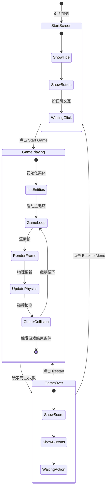

# UX 设计 — [BUG] index.html 文件被截断导致游戏无法启动

> 所属需求：[BUG修复] Start Game 按钮点击无响应

## 交互流程图


```

## 组件线框说明

## 页面结构

### 1. Start Screen（开始界面）
- **Container**: 全屏居中容器
  - **Title Area**: 游戏标题文字区域（顶部 1/3）
  - **Button Group**: 按钮组（中部）
    - Start Game 按钮（主要操作）
    - Settings 按钮（次要操作，可选）
  - **Background**: Canvas 背景层（装饰性动画）

### 2. Game Playing（游戏进行中）
- **Game Canvas**: 全屏游戏渲染区域
  - 玩家实体渲染层
  - 平台/地形渲染层
  - 敌人实体渲染层
  - 金币/道具渲染层
- **HUD Overlay**: 游戏 UI 覆盖层（不遮挡核心游戏区）
  - **Score Display**: 分数显示（右上角）
  - **Lives/Health**: 生命值显示（左上角）
  - **Pause Button**: 暂停按钮（右上角，可选）

### 3. Game Over Screen（游戏结束界面）
- **Modal Container**: 半透明遮罩 + 居中面板
  - **Result Area**: 结果展示区
    - Game Over 标题
    - 最终分数
    - 最高分记录（可选）
  - **Action Buttons**: 操作按钮组
    - Restart 按钮（主要操作）
    - Back to Menu 按钮（次要操作）

### 4. 通用组件
- **Button Component**: 统一按钮样式
  - 文字标签
  - 可选图标
  - 点击反馈区域
- **Text Display**: 文字显示组件
  - 标题级别（大字号）
  - 正文级别（中字号）
  - 数值级别（等宽字体）

## 交互状态定义

## 按钮状态（Start Game / Restart / Back to Menu）
- [x] **normal**: 默认可点击状态，清晰可见
- [x] **hover**: 鼠标悬停时轻微放大（scale 1.05）或亮度提升
- [x] **active**: 点击瞬间缩小（scale 0.95）+ 轻微位移模拟按下
- [x] **disabled**: 游戏初始化中时禁用，opacity 0.5，cursor not-allowed
- [x] **loading**: Start Game 点击后显示 loading 状态（防止重复点击），可选 spinner 或文字变为 "Loading..."

## Canvas 游戏区域状态
- [x] **initializing**: 首次加载时显示加载提示（可选骨架屏或 loading 文字）
- [x] **playing**: 正常游戏进行中，接收输入，渲染实体
- [x] **paused**: 暂停状态（如果实现暂停功能），显示半透明遮罩 + "Paused" 文字
- [x] **game-over**: 游戏结束，停止渲染循环，显示结束面板

## HUD 元素状态
### Score Display
- [x] **normal**: 正常显示当前分数
- [x] **updating**: 分数变化时短暂高亮动画（0.3s 放大 + 颜色变化）

### Lives/Health Display
- [x] **full**: 满血状态
- [x] **damaged**: 受伤后颜色变化（红色闪烁 0.2s）
- [x] **critical**: 生命值低于 20% 时持续红色高亮
- [x] **empty**: 生命值为 0，触发游戏结束

## Game Over Modal
- [x] **entering**: 从下向上滑入 + fade in（0.3s）
- [x] **displayed**: 静态展示结果
- [x] **exiting**: fade out（0.2s）后销毁

## 页面级状态
- [x] **loading**: 页面首次加载，显示 loading 指示器
- [x] **ready**: 所有资源加载完成，显示开始界面
- [x] **error**: 资源加载失败，显示错误提示 + 重试按钮

## 输入响应状态
- [x] **keyboard-active**: 键盘输入被监听（游戏进行中）
- [x] **keyboard-inactive**: 键盘输入被忽略（开始界面/游戏结束界面）
- [x] **touch-active**: 触摸/鼠标输入被监听（移动端支持）

## 响应式/适配规则

## 断点定义
- **Mobile**: < 768px（竖屏手机）
- **Tablet**: 768px - 1024px（平板/小屏笔记本）
- **Desktop**: > 1024px（桌面显示器）

## Canvas 适配规则
### Mobile (< 768px)
- Canvas 宽度：100vw
- Canvas 高度：100vh（全屏）
- 游戏内容缩放：保持 16:9 宽高比，letterbox 填充
- HUD 元素：字号 14px，间距紧凑
- 按钮尺寸：最小 44x44px（符合触摸目标）

### Tablet (768px - 1024px)
- Canvas 宽度：100vw 或固定 768px（居中）
- Canvas 高度：自适应或固定 432px（16:9）
- HUD 元素：字号 16px
- 按钮尺寸：48x48px

### Desktop (> 1024px)
- Canvas 宽度：固定 1024px（居中）
- Canvas 高度：固定 576px（16:9）
- HUD 元素：字号 18px
- 按钮尺寸：支持 hover 效果，最小 40x40px

## UI 元素适配
### Start Screen
- **Mobile**: 标题字号 32px，按钮垂直堆叠，间距 16px
- **Tablet**: 标题字号 48px，按钮垂直堆叠，间距 24px
- **Desktop**: 标题字号 64px，按钮水平排列（可选），间距 32px

### Game Over Modal
- **Mobile**: 宽度 90vw，最大 400px，padding 20px
- **Tablet**: 宽度 500px，padding 32px
- **Desktop**: 宽度 600px，padding 40px

## 输入适配
- **Mobile/Tablet**: 优先触摸输入，虚拟按键（屏幕左右区域）
- **Desktop**: 键盘输入（方向键/WASD），鼠标点击按钮

## 性能适配
- **Mobile**: 降低粒子效果密度，限制帧率 30fps（可选）
- **Tablet/Desktop**: 完整特效，目标 60fps

## UI 资产清单（初稿）

## 图标 (Icons)
- **icon: play** - Start Game 按钮图标，24px，filled 风格，三角形播放符号
- **icon: restart** - Restart 按钮图标，24px，outline 风格，循环箭头
- **icon: home** - Back to Menu 按钮图标，24px，outline 风格，房屋图标
- **icon: pause** - 暂停按钮图标（可选），24px，filled 风格，双竖线
- **icon: heart** - 生命值图标，20px，filled 风格，心形
- **icon: coin** - 金币图标，20px，filled 风格，圆形硬币
- **icon: trophy** - 最高分图标（可选），24px，filled 风格，奖杯

## 插画 (Illustrations)
- **illustration: game-over** - 游戏结束界面背景插画，描述：失败/挑战主题，简约风格，400x300px，用于 Game Over Modal 背景
- **illustration: empty-state** - 加载失败时显示，描述：错误/断线主题，友好风格，300x200px

## 图片 (Images)
- **image: background-pattern** - 开始界面背景纹理，描述：重复平铺图案，游戏主题相关（如像素风格/几何图形），128x128px，可平铺
- **image: logo** - 游戏 Logo（可选），描述：游戏标题图形化设计，PNG 透明背景，400x150px，用于开始界面顶部

## 精灵图 (Sprites) - 游戏内实体
- **sprite: player** - 玩家角色精灵图，描述：角色动画帧（idle/run/jump），每帧 64x64px，横向排列，总尺寸约 512x64px
- **sprite: enemy** - 敌人精灵图，描述：敌人动画帧（patrol/attack），每帧 64x64px，横向排列
- **sprite: platform** - 平台/地形图块，描述：可重复拼接的地形块，32x32px 或 64x64px
- **sprite: coin** - 金币动画帧，描述：旋转动画，每帧 32x32px，4-6 帧

## 字体 (Fonts)
- **font: title** - 标题字体，描述：粗体/像素风格/游戏感强，用于 Game Title 和 Game Over
- **font: ui** - UI 字体，描述：清晰易读的无衬线字体，用于按钮文字和 HUD 数值
- **font: score** - 分数字体（可选），描述：等宽数字字体，用于分数显示，确保数字跳动时不抖动

## 音效 (Audio Assets) - 可选
- **sound: button-click** - 按钮点击音效，描述：短促清脆的点击声，100-200ms
- **sound: game-start** - 游戏开始音效，描述：激励性音效，500ms
- **sound: game-over** - 游戏结束音效，描述：失败/挑战音效，1-2s
- **sound: coin-collect** - 金币收集音效，描述：清脆的叮当声，200ms
- **sound: jump** - 跳跃音效，描述：轻快的跳跃声，150ms
- **sound: hit** - 受伤音效，描述：碰撞/受击声，200ms

## 加载资源 (Loading Indicators)
- **spinner: default** - 默认 loading 动画，描述：旋转圆环或点阵动画，SVG 格式，32x32px
- **progress-bar: linear** - 资源加载进度条（可选），描述：线性进度条，宽度自适应，高度 4px
