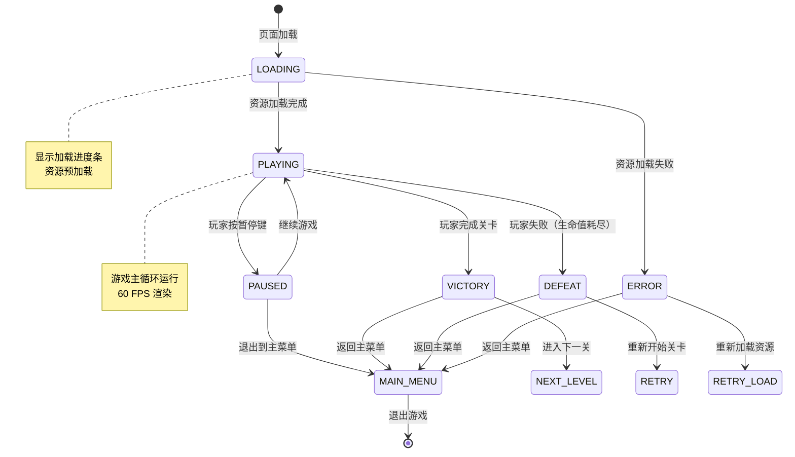

# UX 设计 — 搭建游戏基础框架和Canvas渲染系统

> 所属需求：横向卷轴平台跳跃游戏开发

## 交互流程图


```

## 组件线框说明

## Canvas 容器结构

```
┌─────────────────────────────────────────┐
│  <canvas id="gameCanvas">              │  ← 主游戏画布（16:9）
│                                         │
│  ┌───────────────────────────────────┐ │
│  │   Background Layer (Z-index: 0)   │ │  ← 背景层
│  └───────────────────────────────────┘ │
│  ┌───────────────────────────────────┐ │
│  │   Game Layer (Z-index: 1)         │ │  ← 游戏实体层
│  │   - 角色、敌人、道具               │ │
│  └───────────────────────────────────┘ │
│  ┌───────────────────────────────────┐ │
│  │   UI Layer (Z-index: 2)           │ │  ← UI 层
│  │   ┌─────────────────────────────┐ │ │
│  │   │ FPS Counter (dev mode)      │ │ │  ← 左上角 FPS 显示
│  │   └─────────────────────────────┘ │ │
│  │   ┌─────────────────────────────┐ │ │
│  │   │ Loading Progress Bar        │ │ │  ← 加载进度条（居中）
│  │   │ [████████░░░░░░░░] 60%      │ │ │
│  │   └─────────────────────────────┘ │ │
│  └───────────────────────────────────┘ │
└─────────────────────────────────────────┘
```

## 主要组件区域

### 1. 加载状态界面（LOADING）
- **进度条**：水平条形，居中显示
  - 当前进度百分比文字
  - 已加载资源数 / 总资源数
- **加载提示文字**："Loading assets..." 位于进度条下方

### 2. 游戏运行界面（PLAYING）
- **FPS 计数器**（开发模式）：左上角 10px 偏移
  - 显示格式："FPS: 60"
  - 半透明黑色背景
- **调试信息面板**（开发模式）：右上角
  - 当前状态
  - 摄像机坐标
  - 实体数量

### 3. 错误状态界面（ERROR）
- **错误提示框**：居中显示
  - 错误图标
  - 错误信息文字
  - "Retry" 按钮
  - "Back to Menu" 按钮

### 4. 调试绘制工具
- **矩形边框**：drawDebugRect 绘制的调试框
- **文字标签**：drawDebugText 显示的坐标/状态信息

## 交互状态定义

## Canvas 容器
- **初始化中**：黑色背景，无内容
- **就绪**：显示游戏内容或加载界面
- **窗口调整中**：保持宽高比，letterbox 黑边填充

## 游戏状态管理器
- **LOADING**：
  - 进度条从 0% 增长到 100%
  - 加载文字闪烁动画（可选）
  - 不响应游戏输入
- **PLAYING**：
  - 主循环运行
  - 接受玩家输入
  - FPS 计数器实时更新
- **VICTORY**：
  - 游戏暂停
  - 显示胜利界面（后续工单）
- **DEFEAT**：
  - 游戏暂停
  - 显示失败界面（后续工单）
- **ERROR**：
  - 主循环停止
  - 显示错误提示
  - 提供重试/退出选项

## 资源加载器
- **加载前**：进度 0%，资源列表为空
- **加载中**：
  - 进度条动画（平滑增长）
  - 每个资源加载完成时触发进度更新
- **加载成功**：进度 100%，触发 onLoadComplete 回调
- **加载失败**：
  - 控制台输出 error 日志
  - 使用 1x1 透明占位图
  - 继续加载其他资源

## FPS 计数器（开发模式）
- **正常**：绿色文字，FPS ≥ 55
- **警告**：黄色文字，45 ≤ FPS < 55
- **异常**：红色文字，FPS < 45
- **更新频率**：每 500ms 刷新一次显示值

## 调试绘制工具
- **drawDebugRect**：
  - 默认：红色边框，1px 线宽
  - 可自定义颜色
  - 不填充内部
- **drawDebugText**：
  - 白色文字，12px 字体
  - 黑色描边（提高可读性）
  - 左对齐

## 摄像机坐标转换
- **世界坐标**：游戏逻辑使用的绝对坐标
- **屏幕坐标**：Canvas 上的渲染坐标
- **转换公式**：screenX = worldX - cameraX, screenY = worldY - cameraY
- **边界检查**：超出屏幕范围的对象不渲染（剔除优化）

## 响应式/适配规则

## 断点定义
- **Mobile**: < 768px（竖屏手机）
- **Tablet**: 768px - 1024px（平板/横屏手机）
- **Desktop**: > 1024px（PC/笔记本）

## Canvas 尺寸策略

### Desktop (> 1024px)
- **固定尺寸**：1280x720（16:9）
- **居中显示**：水平垂直居中
- **黑边处理**：letterbox 填充

### Tablet (768px - 1024px)
- **自适应宽度**：占满屏幕宽度
- **高度计算**：width / 16 * 9
- **最大高度**：不超过视口高度的 90%

### Mobile (< 768px)
- **全屏模式**：占满整个视口
- **方向锁定**：建议横屏游玩（显示旋转提示）
- **触摸优化**：触摸区域扩大到 44x44px 最小尺寸

## 窗口 Resize 行为
- **防抖处理**：resize 事件触发后 150ms 内只执行一次调整
- **保持宽高比**：始终维持 16:9 比例
- **重新计算坐标**：摄像机坐标系自动适配新尺寸
- **暂停游戏**：resize 过程中暂停主循环（可选）

## 性能优化
- **低分辨率设备**：Canvas 内部分辨率降低到 960x540，CSS 放大显示
- **高 DPI 屏幕**：使用 window.devicePixelRatio 调整 Canvas 分辨率
- **移动端**：关闭部分粒子效果/阴影以保持 60 FPS

## 文字缩放
- **FPS 计数器**：
  - Desktop: 14px
  - Tablet: 12px
  - Mobile: 10px
- **调试信息**：
  - Desktop: 12px
  - Tablet/Mobile: 10px

## UI 资产清单（初稿）

## 图标（Icons）

### 开发模式图标
- **icon: fps-counter**（FPS 计数器图标，16px，filled 风格，用于标识性能监控）
- **icon: debug-info**（调试信息图标，16px，outline 风格，用于开发者面板）

### 状态图标
- **icon: loading-spinner**（加载动画，32px，animated，用于资源加载中）
- **icon: error**（错误提示图标，48px，filled 风格，红色，用于加载失败）
- **icon: retry**（重试图标，24px，outline 风格，用于重新加载按钮）

### 调试工具图标
- **icon: grid**（网格图标，20px，outline 风格，用于开启/关闭调试网格）
- **icon: ruler**（标尺图标，20px，outline 风格，用于坐标测量工具）

## 插画（Illustrations）

### 状态插画
- **illustration: loading-game**（游戏加载中插画，400x300，像素风格，展示游戏角色剪影）
- **illustration: error-state**（加载错误插画，400x300，像素风格，展示断开连接的游戏手柄）

## 图片（Images）

### 占位图
- **image: placeholder-sprite**（资源加载失败占位图，1x1，透明 PNG，用于图片加载失败降级）
- **image: test-image-1**（测试图片 1，64x64，纯色方块，用于资源加载器测试）
- **image: test-image-2**（测试图片 2，128x128，渐变圆形，用于资源加载器测试）
- **image: test-image-3**（测试图片 3，256x256，棋盘格纹理，用于资源加载器测试）

### 调试纹理
- **image: debug-grid**（调试网格纹理，1024x1024，可平铺，用于坐标系可视化）
- **image: debug-crosshair**（调试十字准星，32x32，透明 PNG，用于标记坐标点）

## UI 元素

### 进度条组件
- **component: progress-bar-bg**（进度条背景，400x20，圆角矩形，深灰色）
- **component: progress-bar-fill**（进度条填充，400x20，圆角矩形，主题色渐变）

### 文字样式
- **font: monospace**（等宽字体，用于 FPS 计数器和调试信息，确保数字对齐）
- **font: pixel**（像素字体，用于游戏内 UI 文字，8px/16px 两种尺寸）

## 动画资源

### 加载动画
- **animation: spinner-rotate**（旋转动画，360° 循环，1s 周期，用于 loading-spinner）
- **animation: progress-shimmer**（进度条光泽动画，从左到右扫过，2s 周期）

## 颜色变量（仅供参考，不含具体色值）
- **color: debug-normal**（调试信息正常状态颜色）
- **color: debug-warning**（调试信息警告状态颜色）
- **color: debug-error**（调试信息错误状态颜色）
- **color: canvas-bg**（Canvas 默认背景色）
- **color: letterbox-bg**（letterbox 黑边颜色）
