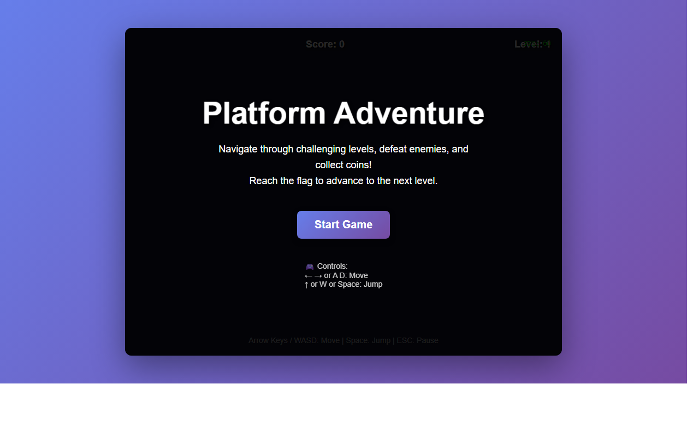

# 开发笔记 — 实现物理引擎和碰撞检测系统

> 2026-05-08 17:40 | LLM

## 产出文件
- [index.html](/app#repo?file=index.html) (23433 chars)

## 自测: 自测 7/7 通过 ✅

| 检查项 | 结果 | 说明 |
|--------|------|------|
| 文件产出 | ✅ | 1 个文件 |
| 入口文件 | ✅ | 存在 |
| 代码非空 | ✅ | 通过 |
| 语法检查 | ✅ | 通过 |
| 文件名规范 | ✅ | 全英文 |
| 磁盘落地 | ✅ | 1 个文件已落盘 |
| 页面截图 | ✅ | 1 张截图 |

## 代码变更 (Diff)

### index.html (修改)
```diff
--- a/index.html
+++ b/index.html
@@ -558,6 +558,253 @@
         this.vy = 0;

         this.patrolStart = patrolStart;

         this.patrolEnd = patrolEnd;

-        thi

-

-/* ... [文件截断显示：原文 23661 字符，当前只显示前 15000；代码本身完整，保留未显示部分] ... */
+        this.onGround = false;

+        this.animFrame = 0;

+        this.animTimer = 0;

+      }

+

+      update(dt) {

+        // Patrol movement

+        if (this.x <= this.patrolStart) {

+          this.vx = CONFIG.ENEMY_SPEED;

+        } else if (this.x >= this.patrolEnd) {

+          this.vx = -CONFIG.ENEMY_SPEED;

+        }

+

+        // Apply physics

+        gameState.physicsEngine.applyGravity(this, dt);

+        gameState.physicsEngine.updatePosition(this, dt);

+

+        // Collision detection

+        CollisionDetector.checkPlatformCollisions(this, gameState.platforms);

+

+        // Animation

+        this.animTimer++;

+        if (this.animTimer > 10) {

+          this.animFrame = (this.animFrame + 1) % 2;

+          this.animTimer = 0;

+        }

+      }

+

+      draw() {

+        ctx.save();

+        ctx.translate(this.x - gameState.cameraX, this.y);

+

+        // Body

+        ctx.fillStyle = '#e74c3c';

+        ctx.fillRect(0, 8, 32, 24);

+

+        // Eyes

+        ctx.fillStyle = '#fff';

+        ctx.fillRect(6, 12, 8, 8);

+        ctx.fillRect(18, 12, 8, 8);

+

... (共 259 行变更)
```

## 页面预览截图



